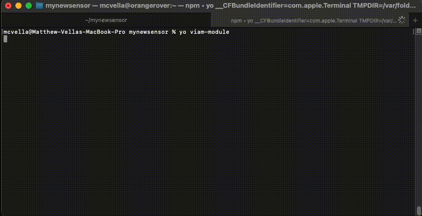

> [!NOTE]
> This generator is now deprecated unless you are creating an [entirely new API](https://docs.viam.com/operate/reference/advanced-modules/create-subtype/).
> To make a module that implements an existing API with a custom model, use the [Viam CLI `viam module generate` command](https://docs.viam.com/operate/get-started/other-hardware/#write-your-module).

# generator-viam-module

Generate [Viam](https://docs.viam.com) [module]((https://docs.viam.com/extend/modular-resources/)) scaffolding using [Yeoman](https://yeoman.io/).



## Current limitations

- Only Python module generation is currently supported.
- The generator currently only supports generation of modules that expose a single modular resource. These modules can be manually extended.

## Usage

First, install node (>=16) and npm if you have not already.
It is usually best to use nvm:

``` bash
curl -o- https://raw.githubusercontent.com/nvm-sh/nvm/v0.39.3/install.sh | bash
nvm install 16
nvm use 16
```

Now install Yeoman:

``` bash
npm install -g yo
```

Then, install the Viam module generator:

``` bash
npm install -g generator-viam-module
```

Now, go to the directory where you want to start creating your Viam module and run:

``` bash
yo viam-module
```

You will be interactively prompted and your module scaffolding will be created.
Then you will add your custom logic, and configure your module for use with your Viam robots.
To read more about Viam modules and modular resources, [read the docs](https://docs.viam.com/operate/get-started/other-hardware/).
